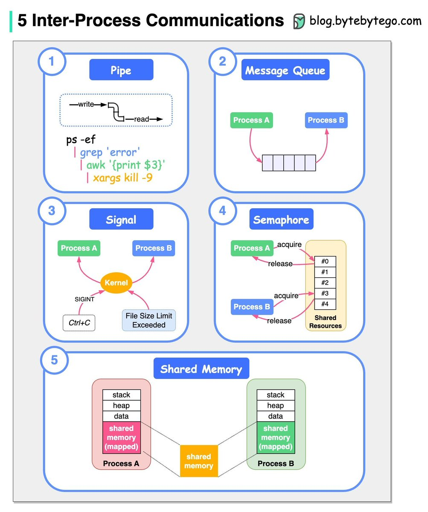
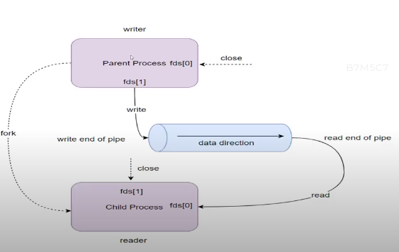
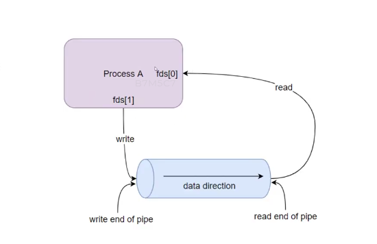

Trong lập trình hệ thống (đặc biệt là trên các hệ điều hành Unix/Linux), **Pipeline (đường ống)** là một trong những cơ chế giao tiếp giữa các tiến trình (**IPC - Inter-Process Communication**) lâu đời, phổ biến và trực quan nhất.

Hiểu một cách đơn giản, Pipeline cho phép bạn **kết nối đầu ra (stdout) của tiến trình này trực tiếp vào đầu vào (stdin) của tiến trình khác**.

Dưới đây là bức tranh toàn cảnh "từ A đến Z" về IPC Pipeline.




---

## 1. Nguyên lý hoạt động của Pipeline

Pipeline hoạt động theo cơ chế **FIFO (First-In, First-Out)** và là cơ chế **giao tiếp một chiều (Half-Duplex)**. Dữ liệu đi vào một đầu của đường ống và đi ra ở đầu kia. Nếu bạn muốn hai tiến trình nói chuyện qua lại (Song công - Full-Duplex), bạn sẽ cần hai đường ống riêng biệt.

* **Đầu ghi (Write End):** Tiến trình A ghi dữ liệu vào đây.
* **Đầu đọc (Read End):** Tiến trình B đợi và đọc dữ liệu từ đây ra.
* **Bộ đệm (Buffer):** Hệ điều hành cung cấp một bộ đệm ẩn trong bộ nhớ để lưu trữ dữ liệu tạm thời giữa hai tiến trình. Nếu bộ đệm đầy, tiến trình ghi sẽ bị chặn (block) cho đến khi tiến trình đọc lấy bớt dữ liệu ra.

---

## 2. Phân loại Pipeline: Anonymous Pipe vs Named Pipe (FIFO)

Trong Linux/Unix, Pipeline được chia làm hai loại chính với mục đích sử dụng khác nhau:

### 2.1. Anonymous Pipe (Đường ống vô danh)

* **Đặc điểm:** Không có tên trên hệ thống tập tin, tồn tại hoàn toàn trong bộ nhớ RAM và **bị xóa ngay khi các tiến trình kết thúc**.
* **Giới hạn:** Chỉ sử dụng được giữa các tiến trình có **quan hệ cha - con** (tạo ra bằng lệnh `fork()`).
* **Cách dùng trong Terminal:** Sử dụng ký tự gạch đứng `|`.
```bash
cat danh_sach.txt | grep "Nguyen"

```


*(Tiến trình `cat` xuất dữ liệu ra $\rightarrow$ `|` chuyển dữ liệu đó làm đầu vào cho `grep` lọc).*



### 2.2. Named Pipe (Đường ống có tên / FIFO)

* **Đặc điểm:** Xuất hiện như một file đặc biệt trên ổ đĩa (nhưng dữ liệu vẫn truyền qua RAM, không ghi xuống ổ cứng).
* **Ưu điểm:** Cho phép **hai tiến trình bất kỳ** (không cần quan hệ cha - con, thậm chí chạy ở hai Terminal khác nhau) giao tiếp với nhau.
* **Cách tạo trong Terminal:** Dùng lệnh `mkfifo`.
```bash
mkfifo my_pipe

```


---




## 3. Cách triển khai Pipeline bằng ngôn ngữ C

Để hiểu sâu về bản chất, hãy xem cách hệ điều hành quản lý Anonymous Pipe thông qua mã nguồn C.

Hệ thống sử dụng hàm `pipe(int fd[2])`, trong đó `fd` là mảng chứa 2 mô tả tệp (file descriptor):

* `fd[0]`: Đầu đọc (Read)
* `fd[1]`: Đầu ghi (Write)

### Ví dụ code: Cha gửi thông điệp cho Con

```c
#include <stdio.h>
#include <unistd.h>
#include <string.h>
#include <sys/types.h>

int main() {
    int fd[2];
    pid_t pid;
    char buffer[100];

    // 1. Tạo pipe trước khi fork
    if (pipe(fd) == -1) {
        perror("Tạo pipe thất bại");
        return 1;
    }

    pid = fork();

    if (pid < 0) {
        perror("Fork thất bại");
        return 1;
    }

    if (pid > 0) { // TIẾN TRÌNH CHA (Ghi dữ liệu)
        close(fd[0]); // Cha không đọc, đóng đầu đọc fd[0] để tránh lãng phí
        
        char msg[] = "Xin chào từ Tiến trình Cha!";
        write(fd[1], msg, strlen(msg) + 1);
        
        close(fd[1]); // Ghi xong thì đóng đầu ghi
    } 
    else { // TIẾN TRÌNH CON (Đọc dữ liệu)
        close(fd[1]); // Con không ghi, đóng đầu ghi fd[1]
        
        // Đọc dữ liệu từ pipe vào buffer
        read(fd[0], buffer, sizeof(buffer));
        printf("Tiến trình Con nhận được: %s\n", buffer);
        
        close(fd[0]); // Đọc xong thì đóng đầu đọc
    }

    return 0;
}

```

---

## 4. Ưu điểm và Nhược điểm của IPC Pipeline

### Ưu điểm:

* **Cực kỳ đơn giản:** Dễ dùng, đặc biệt là trong môi trường Shell/Terminal để kết hợp các lệnh ngắn thành một công cụ mạnh mẽ.
* **Hiệu năng cao:** Dữ liệu được truyền trực tiếp qua bộ đệm RAM của Kernel, không tốn tài nguyên I/O của ổ cứng.
* **Đồng bộ hóa tự động:** Hệ điều hành tự quản lý việc block/unblock. Tiến trình đọc sẽ tự dừng lại đợi nếu chưa có dữ liệu, tiến trình ghi sẽ tự dừng nếu bộ đệm đầy.

### Nhược điểm:

* **Giao tiếp một chiều:** Muốn giao tiếp 2 chiều phải tạo 2 pipe, quản lý rất cồng kềnh.
* **Giới hạn phạm vi:** Anonymous pipe chỉ dùng cho tiến trình cha-con. Kể cả Named Pipe cũng chỉ dùng được giữa các tiến trình **trên cùng một máy máy tính** (không truyền qua mạng được như Socket).
* **Dữ liệu dạng dòng (Stream-oriented):** Không có ranh giới thông điệp (message boundary). Nếu bạn ghi 2 câu liên tiếp, phía đọc có thể đọc ra thành 1 câu dài nếu không chủ động phân tách.

---

## 5. Khi nào nên dùng Pipeline?

* Dùng **Anonymous Pipe** khi bạn viết một chương trình đa tiến trình phức tạp, cần sinh ra tiến trình con để xử lý một tác vụ phụ (ví dụ: tiền xử lý dữ liệu) rồi trả kết quả về cho tiến trình chính.
* Dùng **Named Pipe (FIFO)** khi bạn có 2 ứng dụng độc lập chạy ngầm (Daemon) trên cùng một máy Linux và cần truyền tín hiệu hoặc log cho nhau một cách nhanh chóng.
* *Lưu ý:* Nếu hệ thống của bạn đòi hỏi truyền nhận dữ liệu có cấu trúc phức tạp giữa nhiều tiến trình độc lập, hãy cân nhắc sử dụng **Shared Memory** (tốc độ cao nhất) hoặc **Message Queues**.


---
---
---

Khi một tiến trình cố gắng đọc từ một pipeline rỗng (không có dữ liệu bên trong bộ đệm RAM), hành vi của nó sẽ phụ thuộc hoàn toàn vào cấu hình của đường ống đó: **Chế độ Chặn (Blocking - Mặc định)** hoặc **Chế độ Không chặn (Non-blocking)**.

Dưới đây là kịch bản chi tiết cho từng trường hợp:

---

## Trường hợp 1: Chế độ mặc định - Blocking (Chờ đợi kiên nhẫn)

Theo mặc định, mọi pipeline (cả Anonymous Pipe và Named Pipe) đều hoạt động ở chế độ **Blocking (Chặn)**. Nếu tiến trình đọc (`read()`) gọi lệnh khi pipeline rỗng, hệ điều hành sẽ xử lý dựa vào việc **đầu ghi (Write End)** còn mở hay không:

### Kịch bản A: Đầu ghi VẪN CÒN MỞ (Còn người có khả năng ghi)

Nếu vẫn còn ít nhất một tiến trình đang giữ đầu ghi của pipeline (tức là hệ thống hiểu rằng *"hiện tại rỗng nhưng tương lai có thể sẽ có dữ liệu"*):

* **Hành vi:** Tiến trình đọc sẽ bị **đóng băng (treo/block)** ngay tại dòng lệnh `read()`. Nó sẽ rơi vào trạng thái ngủ (Sleep) và không tiêu tốn chu kỳ CPU nào cả.
* **Kết quả:** Tiến trình đọc sẽ đứng đợi mãi mãi cho đến khi một trong hai điều sau xảy ra:
1. Tiến trình ghi đẩy dữ liệu vào $\rightarrow$ Tiến trình đọc lập tức "thức dậy", hốt dữ liệu và chạy tiếp.
2. Tất cả các tiến trình ghi đóng đầu ghi lại $\rightarrow$ Rơi vào Kịch bản B.


### Kịch bản B: Tất cả đầu ghi ĐÃ ĐÓNG (Không còn ai ghi nữa)

Nếu không còn tiến trình nào giữ đầu ghi của pipeline nữa (tức là nguồn cấp dữ liệu đã cạn kiệt hoàn toàn):

* **Hành vi:** Lệnh `read()` sẽ **không bị chặn** nữa. Nó sẽ trả về ngay lập tức với giá trị là **`0`**.
* **Ý nghĩa:** Trong lập trình C/Linux, hàm `read()` trả về `0` có nghĩa là **End-of-File (EOF)** – Tín hiệu báo rằng "Đường ống đã cạn và đóng cửa, không còn gì để đọc nữa đâu". Dựa vào số `0` này, tiến trình đọc sẽ biết để thoát khỏi vòng lặp và kết thúc tác vụ.

---

## Trường hợp 2: Chế độ Non-blocking (Không chặn - Kiểm tra nhanh)

Nếu bạn chủ động cấu hình pipeline sang chế độ **Non-blocking (Không chặn)** bằng cách thêm cờ `O_NONBLOCK` khi mở file (đối với Named Pipe) hoặc dùng hàm `fcntl()` (đối với Anonymous Pipe):

* **Hành vi:** Khi pipeline rỗng, lệnh `read()` sẽ **không dừng lại đợi** một mili-giây nào cả. Nó quay xe và trả về giá trị **`-1`** ngay lập tức.
* **Mã lỗi:** Hệ điều hành sẽ đặt biến toàn cục `errno` thành lỗi `EAGAIN` hoặc `EWOULDBLOCK`.
* **Ý nghĩa:** Mã lỗi này báo cho tiến trình đọc biết: *"Hiện tại RAM trống rỗng, hãy đi làm việc khác đi rồi quay lại kiểm tra (poll) sau nhé!"*. Cách này thường dùng khi một tiến trình cần quản lý nhiều việc cùng lúc và không muốn bị "chết đứng" ở một đường ống.

---

## Tóm tắt trực quan

| Trạng thái đầu ghi | Chế độ Blocking (Mặc định) | Chế độ Non-blocking (`O_NONBLOCK`) |
| --- | --- | --- |
| **Còn mở** | **Bị đóng băng (Block)**, ngủ đông chờ dữ liệu. | Trả về `-1` (Lỗi `EAGAIN`), chạy tiếp ngay. |
| **Đã đóng hết** | Trả về `0` (**EOF** - Báo hiệu kết thúc dòng). | Trả về `0` (**EOF** - Báo hiệu kết thúc dòng). |


