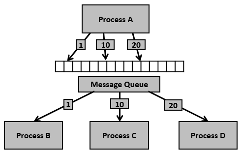

Nếu như **Pipeline** bị giới hạn bởi giao tiếp một chiều, **Shared Memory** đau đầu vì lỗi đồng bộ (Race Condition), thì **Message Queue (Hàng đợi thông điệp)** chính là cơ chế dung hòa được cả hai yếu tố: **Giao tiếp hai chiều đáng tin cậy** và **Tự động đồng bộ hóa**.

Đây là một trong những cơ chế IPC mạnh mẽ và được sử dụng cực kỳ phổ biến trong các hệ thống Linux/Unix. Dưới đây là toàn bộ bản đồ kiến thức từ A đến Z về **IPC Message Queue**.

---

## 1. Bản chất và Nguyên lý hoạt động

**Message Queue** là một danh sách liên kết các thông điệp (messages) được quản lý trực tiếp bởi Nhân hệ điều hành (Kernel). Nó hoạt động theo mô hình **Hàng đợi (Queue)** nhưng linh hoạt hơn rất nhiều so với FIFO thông thường.

### Các đặc điểm cốt lõi:

* **Hướng thông điệp (Message-oriented):** Khác với Pipeline (dữ liệu chảy thành một dòng stream không rõ đầu đuôi), Message Queue chia dữ liệu thành từng **gói thông điệp riêng biệt**, có ranh giới rõ ràng. Bên ghi bắn vào 1 gói, bên đọc sẽ hốt ra đúng 1 gói đó.
* **Bất đồng bộ (Asynchronous):** Tiến trình Ghi (Sender) có thể ném thông điệp vào hàng đợi rồi lập tức đi làm việc khác, không cần quan tâm Tiến trình Nhận (Receiver) có đang chạy hay không. Thông điệp sẽ nằm an toàn trên RAM của Kernel cho đến khi có người đến lấy.
* **Đồng bộ tự động:** Hệ điều hành tự quản lý việc khóa. Nếu hàng đợi rỗng, tiến trình đọc sẽ tự đi ngủ (block) chờ dữ liệu. Nếu hàng đợi đầy, tiến trình ghi cũng sẽ bị chặn lại để tránh quá tải RAM.
* **Đọc theo loại (Type-based Selection):** Đây là tính năng bá đạo nhất. Mỗi thông điệp gửi vào queue sẽ được gán một **con số định danh (Message Type)**. Tiến trình nhận có thể chọn: *"Tôi chỉ muốn lọc ra các thông điệp có Type = 2"* thay vì bắt buộc phải đọc thông điệp đầu tiên trong hàng đợi.

---

## 2. Phân loại Message Queue trong Linux

Tương tự như Shared Memory, Message Queue trong Linux cũng có hai dòng API song song:

### a. System V Message Queue (Cổ điển - Phổ biến)

* **Hàm hệ thống:** `msgget()`, `msgsnd()`, `msgrcv()`, `msgctl()`.
* **Định danh:** Dùng một mã số khóa `key_t` (tạo từ đường dẫn file bằng hàm `ftok()`).
* **Đặc điểm:** Dù cổ điển nhưng System V Message Queue vẫn được dùng rất nhiều vì tính năng lọc tin nhắn theo `Type` hoạt động cực kỳ mượt mà.

### b. POSIX Message Queue (Hiện đại)

* **Hàm hệ thống:** `mq_open()`, `mq_send()`, `mq_receive()`, `mq_close()`, `mq_unlink()`.
* **Định danh:** Dùng một đường dẫn file ảo (ví dụ: `"/my_queue"`), xuất hiện trong thư mục thiết bị ảo của hệ thống.
* **Đặc điểm:** Hỗ trợ cơ chế gửi thông điệp theo độ ưu tiên (**Priority**) và có khả năng phát tín hiệu thông báo bất đồng bộ (`mq_notify`) khi có tin nhắn mới đến.



---

## 3. Cấu trúc một Thông điệp (Message Structure)

Trong lập trình C (đặc biệt là System V), một thông điệp gửi vào queue bắt buộc phải tuân theo một khuôn mẫu (Struct) mà phần đầu luôn là một số nguyên có dấu biểu diễn `mtype` (Message Type):

```c
struct my_msg_st {
    long int my_msg_type;     /* BẮT BUỘC: Phải lớn hơn 0, dùng để định danh/lọc */
    char any_data[BUFSIZ];    /* TÙY CHỌN: Dữ liệu bạn muốn truyền đi (struct, chuỗi, số...) */
};

```

---

## 4. Minh họa Code thực tế (System V Message Queue)

Chúng ta sẽ viết hai chương trình độc lập: **Sender** (Gửi tin nhắn kèm Type) và **Receiver** (Chọn lọc lọc tin nhắn để đọc).

### File 1: `sender.c` (Gửi 2 tin nhắn với 2 Type khác nhau)

```c
#include <stdio.h>
#include <stdlib.h>
#include <string.h>
#include <sys/ipc.h>
#include <sys/msg.h>

struct msg_buffer {
    long msg_type;
    char msg_text[100];
};

int main() {
    key_t key = ftok("queue_key_file", 65); // Tạo key định danh
    int msgid = msgget(key, 0666 | IPC_CREAT); // Tạo/Mở Message Queue

    struct msg_buffer msg1, msg2;

    // Tin nhắn 1: Loại 1 (Tin khẩn cấp)
    msg1.msg_type = 1;
    strcpy(msg1.msg_text, "CẢNH BÁO: Hệ thống quá nhiệt!");
    msgsnd(msgid, &msg1, sizeof(msg1.msg_text), 0);

    // Tin nhắn 2: Loại 2 (Tin thông thường)
    msg2.msg_type = 2;
    strcpy(msg2.msg_text, "Thông báo: Bảo trì hệ thống vào 12h đêm.");
    msgsnd(msgid, &msg2, sizeof(msg2.msg_text), 0);

    printf("Sender: Đã bắn 2 thông điệp (Type 1 và Type 2) vào Queue.\n");
    return 0;
}

```

### File 2: `receiver.c` (Chỉ chủ động chọn đọc tin nhắn Type 2 trước)

```c
#include <stdio.h>
#include <stdlib.h>
#include <sys/ipc.h>
#include <sys/msg.h>

struct msg_buffer {
    long msg_type;
    char msg_text[100];
};

int main() {
    key_t key = ftok("queue_key_file", 65);
    int msgid = msgget(key, 0666 | IPC_CREAT);

    struct msg_buffer msg;

    printf("Receiver: Tôi sẽ chủ động lọc lấy tin nhắn Type 2 trước...\n");
    
    /* Tham số thứ 4 chính là Type cần lọc (ở đây chọn số 2) */
    msgrcv(msgid, &msg, sizeof(msg.msg_text), 2, 0);

    printf("Receiver nhận được tin nhắn Type %ld: %s\n", msg.msg_type, msg.msg_text);

    // Xóa Message Queue khỏi hệ thống RAM của Kernel sau khi dùng xong
    msgctl(msgid, IPC_RMID, NULL);
    return 0;
}

```

### Cách chạy trên Ubuntu:

Trước khi chạy, bạn tạo một file trống tên là `queue_key_file` để hàm `ftok()` dùng làm gốc tạo key:

```bash
touch queue_key_file
gcc sender.c -o sender
gcc receiver.c -o receiver

./sender   # Đẩy dữ liệu vào queue
./receiver # Lọc dữ liệu ra

```

---

## 5. Ưu điểm và Nhược điểm của Message Queue

### Ưu điểm:

* **Giao tiếp an toàn tuyệt đối:** Nhờ cơ chế đóng gói thành gói tin và Kernel tự đồng bộ, bạn không bao giờ lo bị lỗi đè dữ liệu (Race Condition) như Shared Memory.
* **Ghép nối lỏng lẻo (Decoupling):** Sender và Receiver không cần chạy đồng thời, không cần biết mặt nhau, chỉ cần biết chung cái Queue.
* **Đọc có chọn lọc:** Khả năng lọc tin nhắn theo `Type` giúp xây dựng mô hình phân quyền tác vụ rất hay (Ví dụ: 1 queue chung nhưng Tiến trình A chuyên xử lý tin khẩn cấp Type 1, Tiến trình B chuyên xử lý tin Log thông thường Type 2).

### Nhược điểm:

* **Giới hạn dung lượng:** Vì thông điệp nằm trên RAM của Kernel, hệ điều hành giới hạn nghiêm ngặt kích thước tối đa của một thông điệp (thường là 8KB) và tổng dung lượng của toàn bộ queue để tránh nghẽn RAM hệ thống.
* **Tốc độ:** Chậm hơn Shared Memory do mỗi lần gửi/nhận, dữ liệu phải thực hiện copy 2 lần (Từ Tiến trình A $\rightarrow$ RAM Kernel $\rightarrow$ Tiến trình B).

---

## 6. So sánh tổng quan các cơ chế IPC phổ biến

| Tiêu chí | Pipeline | Shared Memory | Message Queue | Socket |
| --- | --- | --- | --- | --- |
| **Đơn vị dữ liệu** | Dòng Byte liên tục | Vùng RAM dùng chung | **Từng gói thông điệp** | Dòng Byte hoặc Gói tin |
| **Tự động đồng bộ** | Có | **Không** (Cần Mutex) | **Có** | Có |
| **Tốc độ** | Nhanh | **Nhanh nhất** | Trung bình / Nhanh | Trung bình (Chậm nhất) |
| **Phạm vi** | Nội bộ máy | Nội bộ máy | Nội bộ máy | **Nội bộ hoặc Xuyên mạng** |

**Khi nào nên chọn Message Queue?** Khi bạn thiết kế hệ thống có nhiều tiến trình cần trao đổi các thông điệp có cấu trúc, cần tính năng lọc tin nhắn theo độ ưu tiên/phân loại, và cần một cơ chế chạy an toàn, lập trình nhàn hạ mà không muốn tự viết code quản lý khóa Mutex phức tạp.